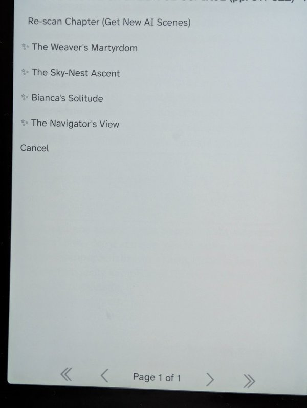
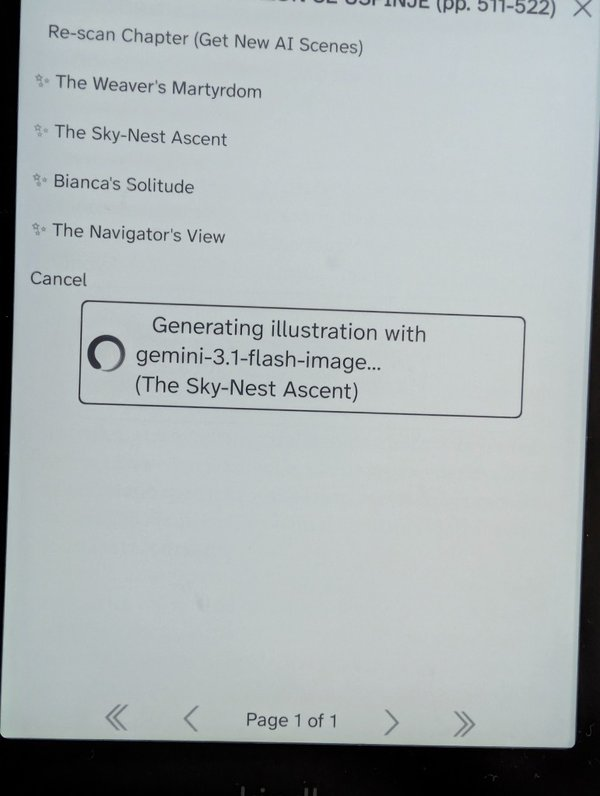
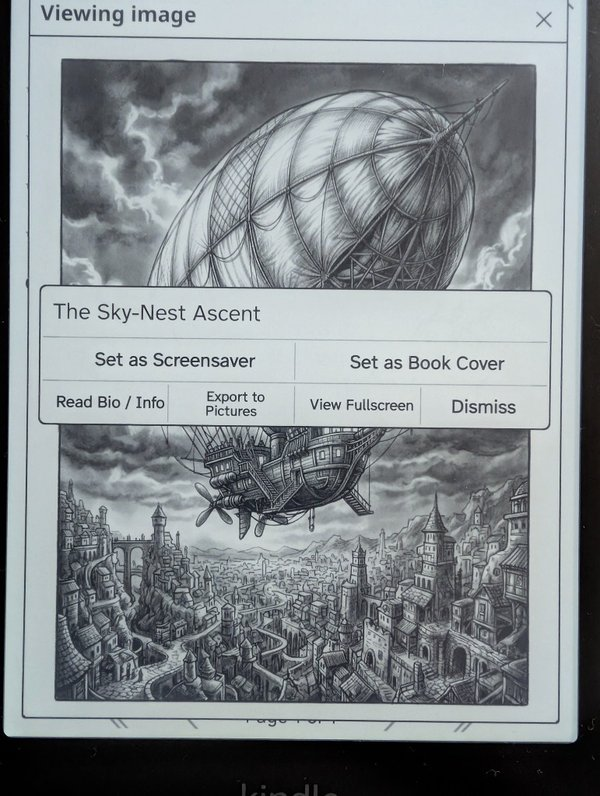
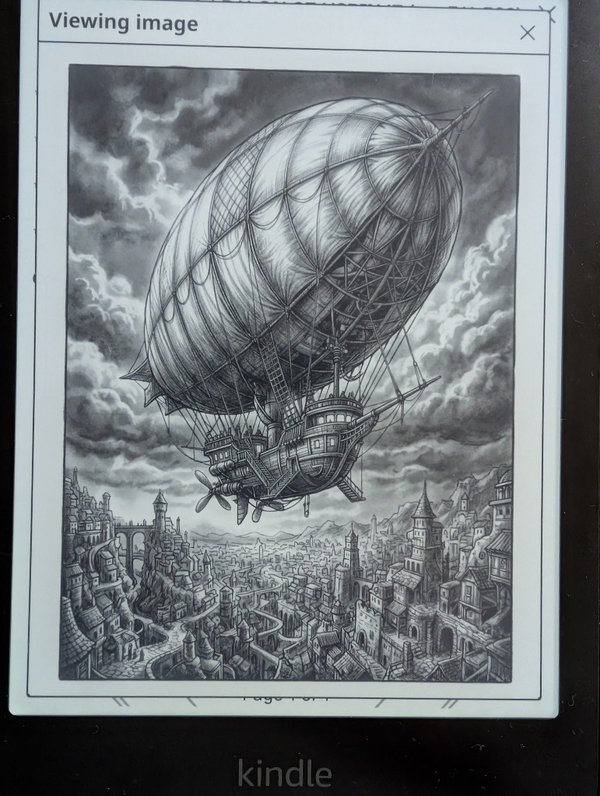

# 📖 Gemini AI Book Illustrator for KOReader

[](https://ko-fi.com/fiksr)
[](LICENSE)
[](https://github.com/koreader/koreader)

> **`gemini_illustrator.koplugin`** — Intelligent, genre-aware scene visualization, character dossier extraction, and portrait concept art generator for KOReader. Powered by Google Gemini (Free Text Brain) and multi-backend image generators (Pollinations Free, Fal.ai FLUX.1, Google Nano Banana, OpenAI DALL-E 3) calibrated specifically for 300 PPI E-Ink displays.

---

<p align="center">
  
  
  
  
</p>

---

## ✨ Features Overview

### 🎭 AI Cast of Characters & Dossier Profile Cards
* **3 Extraction Modes**:
  * 📚 **Read So Far (Spoiler-Free)**: Scans all pages read up to your current reading position without spoiling future chapters.
  * 🌐 **Full Book (Internet Search Grounding)**: Uses Google Search Grounding to identify canonical characters, wikis, and literary databases for the entire book.
  * 📖 **Current Chapter Cast**: Extracts only characters actively appearing in the current chapter.
* 🎴 **Rich Character Dossier Cards (`TextViewer`)**: Tap any character to open an instant profile dossier displaying their **Role**, **Story & Background Bio**, and **Visual AI Concept** before generating an image.
* ⚡ **Persistent Portrait Caching (0-Second Instant Load)**: Once a portrait is generated, it is permanently cached in `/mnt/us/koreader/bookart/portraits/`. Tapping the character in the future loads the image instantly with **0 seconds delay and 0 API quota burned**.
* 🔄 **One-Tap AI Regeneration**: Want a different art style or expression? Tap **`🔄 Regenerate Portrait`** to create a fresh portrait and update the cached file.
* 🏷️ **Visual Status Indicators**: Characters in the menu are marked with `[Saved - View]` (ready instantly) or `[Create Portrait]`.

---

### ✨ Scene Visualizer & Chapter Suggestions
* 🎬 **Chapter Scene Suggestions**: Gemini analyzes the full chapter and proposes **3 to 4 dramatic, visually striking moments** complete with scene summaries and direct book quotes.
* 📄 **Illustrate Current Page**: Instantly illustrate the open book page.
* 📑 **Custom Page Range**: Scan specific passages (e.g. pages 15–28).
* 📝 **Highlight Trigger**: Select any text or paragraph $\rightarrow$ tap **✨ Gemini Illustrate** in the popup menu.
* 📚 **Direct Multi-Format Book Engine**: High-speed, uncompressed text extraction supporting **EPUB** (internal XML parser), **MOBI / AZW3** (PalmDoc LZ77 decompressor), **FB2**, **PDF**, and **TXT**.

---

### 🎨 Multi-Provider Image Engines
Choose your preferred image generator in settings based on your style and account preferences:

| Provider | Model | Tier / Pricing | Speed | Description |
| :--- | :--- | :--- | :--- | :--- |
| 🌸 **Pollinations** | **FLUX.1 Open Engine** | **$0.00 (100% Free)** | ~10s | Unlimited free generations, no API key or sign-up required. |
| ⚡ **Fal.ai** | **FLUX.1 [schnell]** | [Fal.ai Pricing](https://fal.ai/pricing) | ~1.5s | Ultra-fast ~1s generation, very low cost per image. |
| 🎨 **Fal.ai** | **FLUX.1 [dev]** | [Fal.ai Pricing](https://fal.ai/pricing) | ~5s | Maximum photorealism and fine detail. |
| 🍌 **Google** | **Nano Banana 2 Lite** | [Google AI Pricing](https://ai.google.dev/pricing) | ~4s | Gemini multimodal fast E-Ink portrait engine. |
| 🍌 **Google** | **Nano Banana 2** | [Google AI Pricing](https://ai.google.dev/pricing) | ~6s | Gemini multimodal standard concept art. |
| 🍌 **Google** | **Nano Banana Pro** | [Google AI Pricing](https://ai.google.dev/pricing) | ~8s | High-detail artistic illustration. |
| 🤖 **OpenAI** | **DALL-E 3** | [OpenAI Pricing](https://openai.com/api/pricing/) | ~10s | Standard vertical DALL-E 3 portraits. |

---

### 🖋️ 6 E-Ink Art Styles (Chiaroscuro Calibrated)
Strictly calibrated for monochrome 300 PPI E-Ink reading with deep blacks, crisp linework, and strong contrasts:
* 🖋️ **Victorian Engraving & Ink**: Gustave Doré and Albrecht Dürer copperplate etching aesthetic.
* 📖 **Graphic Novel & Comic Noir**: High-contrast chiaroscuro with heavy ink shadows (Frank Miller / Mike Mignola style).
* 🪵 **Vintage Woodcut**: Bold medieval woodblock printmaking.
* ✏️ **Charcoal & Pencil Sketch**: Soft tonal shading and academic portraiture.
* 🎬 **Cinematic B&W**: 35mm monochrome film photography with dramatic lighting.
* 🧠 **Auto (Smart Genre Detection)**: Gemini detects whether the book is Sci-Fi, Dark Fantasy, Noir, Historical Fiction, or Romance and adapts the visual style automatically.

---

### 📱 Instant Phone QR Code Pairing (Local Wi-Fi)
No tedious typing on E-Ink keyboards!
1. Open plugin menu $\rightarrow$ **🔑 API Keys & Connection Setup** $\rightarrow$ **📱 Pair with Phone (Scan QR Code)**.
2. Scan the on-screen QR code with your mobile camera.
3. Paste your Gemini, Fal.ai, or OpenAI API keys into the mobile web page and tap **Send & Save to Kindle**.
4. Keys are transferred **100% locally** over your home Wi-Fi (no cloud or third-party servers).

---

### 📁 Saved Illustrations Gallery & Export
* **📁 Saved Illustrations Gallery**: Browse, view fullscreen, and manage all your generated artwork categorized by `🎭 [Portrait]`, `📖 [Cover]`, and `🖼️ [Scene]`.
* 🖼️ **Set as Screensaver**: Direct 1-tap copy to Kindle `/mnt/us/screensavers/`.
* 📖 **Set as Book Cover**: Replace the current book cover in KOReader library.
* 💾 **Export to Pictures**: Save illustrations to `/mnt/us/pictures/` for USB transfer.
* 📖 **Read Bio / Info**: Re-read the full character dossier while viewing any artwork.

---

## 📱 Clean 1-Page TouchMenu Navigation

The plugin menu fits comfortably on a single screen without pagination:

```text
┌─────────────────────────────────────────────────────────────────┐
│ 🎭 Cast of Characters (Profiles & Portraits)                 >  │
│ ✨ Scenes & Book Illustrations                               >  │
│ 📁 Saved Illustrations Gallery...                               │
│ ─────────────────────────────────────────────────────────────── │
│ 🖼️ Choose Image Model & Provider                             >  │
│ 🎨 Choose Art Style                                          >  │
│ 🧠 Choose Text Analysis Model                                >  │
│ 🌐 Google Search Grounding                                [O]   │
│ 📐 Image Resolution & Speed                                  >  │
│ 🔑 API Keys & Connection Setup                               >  │
└─────────────────────────────────────────────────────────────────┘
```

---

## 📦 Installation

1. Clone or download this repository.
2. Copy the `gemini_illustrator.koplugin` folder to your KOReader plugins directory:
   ```bash
   # On Kindle (via USB or SSH):
   /mnt/us/koreader/plugins/gemini_illustrator.koplugin

   # On Kobo / Linux / Android:
   <koreader-dir>/plugins/gemini_illustrator.koplugin
   ```
3. Restart KOReader. The plugin will appear in the top menu bar under **AI Book Illustrator**.

---

## 🔑 Getting API Keys

* **Google Gemini API Key (Free Text Brain & Nano Banana)**:  
  Get a free key from [Google AI Studio](https://aistudio.google.com/).
* **Fal.ai API Key (Ultra-cheap FLUX.1)**:  
  Get a key from [fal.ai](https://fal.ai/).
* **OpenAI API Key (DALL-E 3)**:  
  Get a key from [platform.openai.com](https://platform.openai.com/).
* **Pollinations (FLUX.1 Free)**:  
  **No key needed!** Select `🌸 Pollinations Flux.1` in settings and start illustrating immediately.

---

## ☕ Support the Project

If you enjoy illustrating your books and exploring characters on your E-Reader, consider supporting future development:

<p align="left">
  <a href="https://ko-fi.com/fiksr" target="_blank">
    
  </a>
</p>

* **Ko-fi**: [https://ko-fi.com/fiksr](https://ko-fi.com/fiksr)

---

## 📄 License

Distributed under the [MIT License](LICENSE). Contributions, bug reports, and feature requests are welcome!
